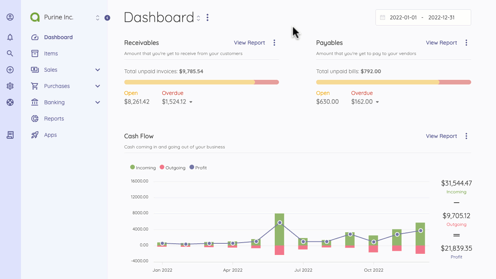

Overview
=========

The email provided while signing up to Akaunting will be the primary email address. 

You can drop a profile picture on the profile page. Akaunting allows you to keep books of multiple companies on the same profile. So you can switch between your companies with one click.

Profile
=========

You can view your profile by clicking the avatar icon on the top left of the Sidebar. You can change your personal information such as name, email, profile picture, and portal preferences such as companies, roles, landing page, and language.

Users
=========

The Akaunting profile creator is, by default, the admin. You can add only two users to the free plan. To add more users, check the [Akaunting Premium](https://akaunting.com/plans). 

While creating a user, you'll need to choose the user's role and company. The user will only have access to assigned companies and role permissions. 

How can I create a new User?
You should follow these steps to add a new user.
- Click the profile icon on the top left of the Sidebar.
- Go to Team
- On the Team page, Click "Invite User" on the top right of the page
- Enter the required fields and Save
- An invitation link will be sent to your new team member.

When you send an invitation link to a user, They can be able to access your company portal with the given permission. If the permission settings do not meet your needs, you can try Role Management. 

If your Akaunting is not self-hosted, you must upgrade to the [Premium Cloud Plan](https://akaunting.com/plans). 

