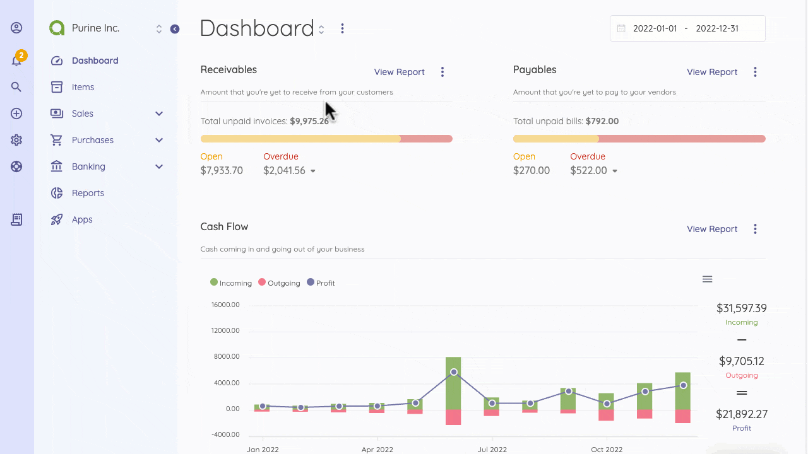
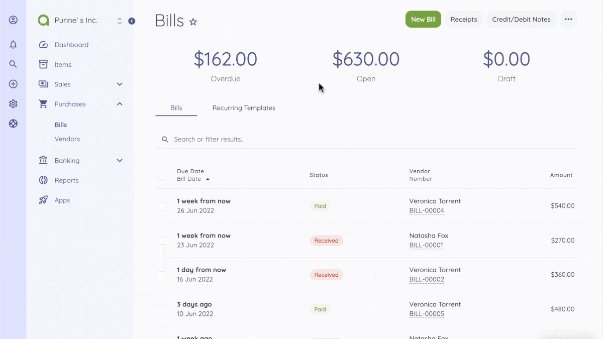
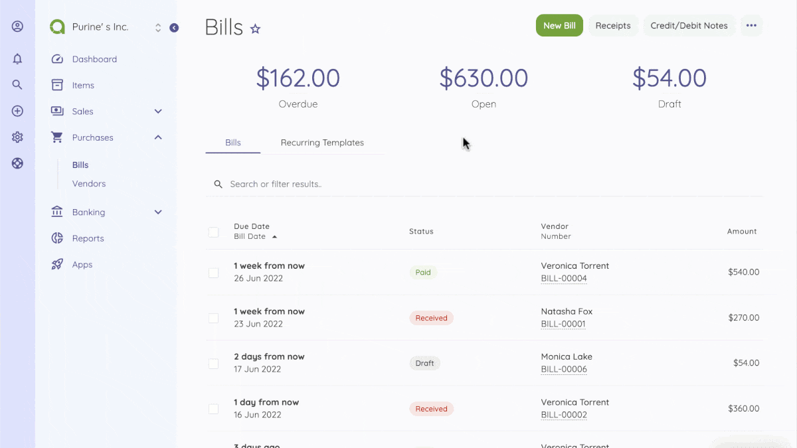

Bills
=========

All your company’s expenses are logged  in Bills under the Purchases section.
Bills are the first purchase types in the Akaunting. When you make a purchase, the vendor sends  a bill with details of the product or service.. 

Bills are generally recorded as unpaid. When it is paid, you should record it as a payment.

On the Bills page, you will see the overview of your all bills categorized into Overdue, Open and Draft. Here, all bills are listed and you can sort them by date, status, or amount.

At the top right of the Bills page, you’ll find the New Bill, Receipts and Credit/Debit Notes buttons.
When creating a new bill, the following fields are displayed:

- **Vendor**: To whom you pay the bill.
- **Bill Date**: Date when the bill is issued.
- **Due Date**: Date when the bill is due to be paid.
- **Bill Number**: This is assigned by default, but you can edit it..
- **Order Number**: A number assigned to that bill.
- **Items**: The list of all items assigned to the bill. You can add multiple items from the Items page.
- **Description**: This gives more information about the item.
- **Quantity**: The  number of product or service you are purchasing.
- **Price**: The purchase price of the item. It will be updated automatically but you have the opportunity to edit it.
- **Tax**: Add applicable   Tax Rates. You can select multiple taxes. See the Settings > Tax Rates documentation for more details.
- **Total**: This isIt willautomatically calculated automatically the total price of the item according to the item quantity, discount and tax. It is not an editable field. In order to change the total amount, you should change the item price, or quantity or applied discount.
- **Notes**: You can add a custom note to the bill.
- **Category**: Category of the invoice to be used in reports.
- **Attachment**: You can attach a file related to that invoice

On the Bills page, you can view the status of your bills group into paid, partial, or received. The status of bills change automatically depending on your actions. 

By checking a Bill, you get the options to Mark Received, Cancel, Delete or Export. You can also hover on a bill to reveal a summary of the bill. The hover also gives you more options - Show, Edit, Duplicate and More.

You can complete the following actions to create a new bill.

- Go to the Bills Page or directly click the Bills button on the quick add section.
- Click on New Bill Button
- Fill out the form (Here you can add a new vendor and item instantly)
- Save the Bill
