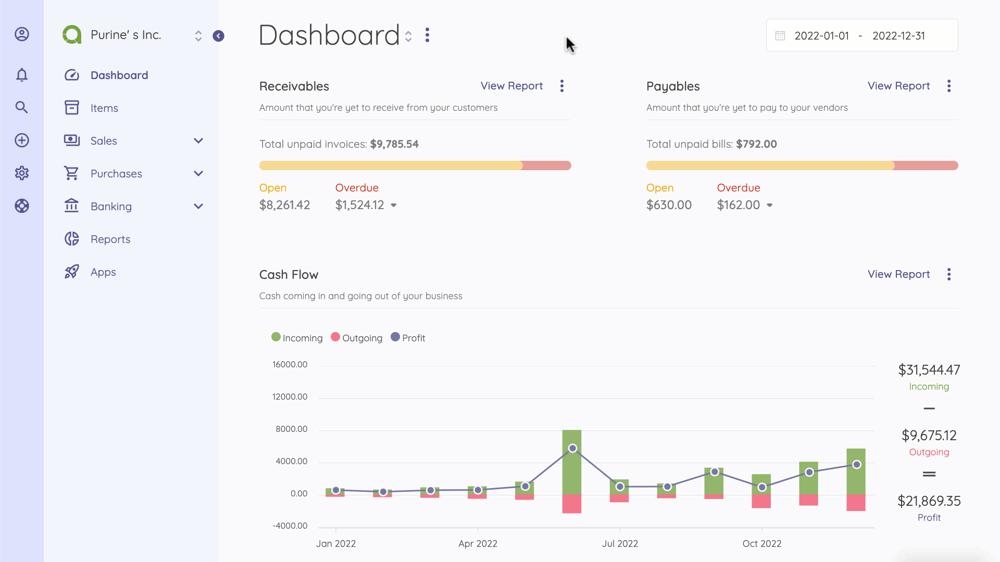
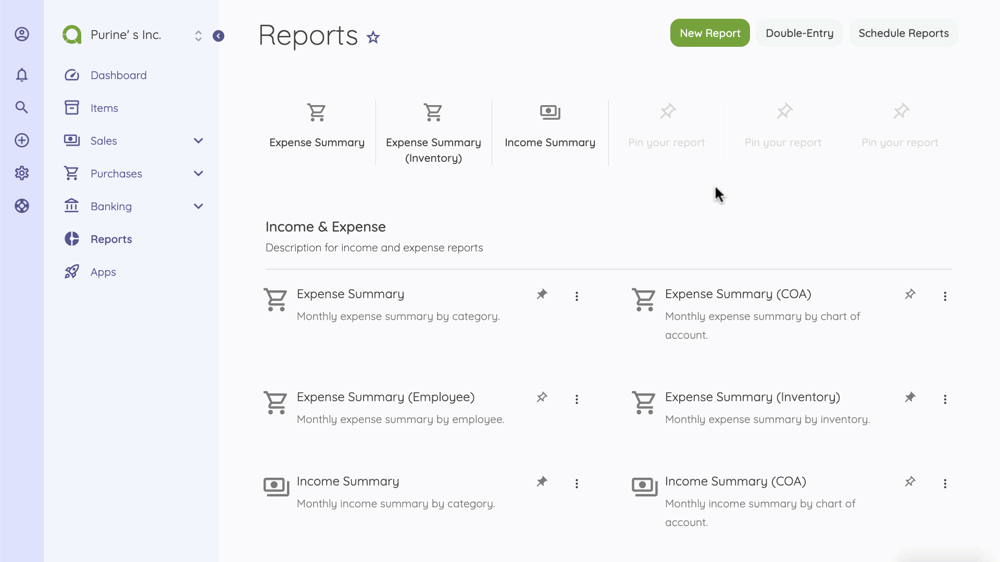
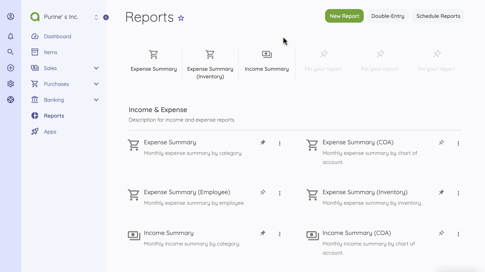

Reports
=======

Reports allows you to get detailed financial data and help you better visualize all the information you need to improve your business. It gives you as a business owner a good idea of where your business income stands, month by month, and categorised.

All reports are displayed under the default currency. Income and expenses created under a different currency will be converted based on the currency rate at the time they were created.

In the home page of reports, you can see the report name, it's total amount, description, and the horizontal ellipsis (three dots) that allows you to edit/delete the report.

### View Report

If you click the report name/icon you'll be redirected to the report view page where you can see the data, filter them, print, and export them.

## New Reports

The following details are displayed as blank to be filled, some are required and some not. Those marked with red star are required.

- **Name**: The name of report.
- **Type**: There are 5 default types and it can be extended by apps.
- **Description**: Description to be used in report list.

The following fields maybe available or not depending on the selected report type:

- **Group By**: You can group report by category, customer, etc. Each report type has its own groups.
- **Period**: You can set the report in monthly, quarterly, and yearly base.
- **Basis**: [Here](https://akaunting.com/docs/faq/accrual-vs-cash) you can learn more about cash and accrual accounting.
- **Chart**: Chart type to be used.

