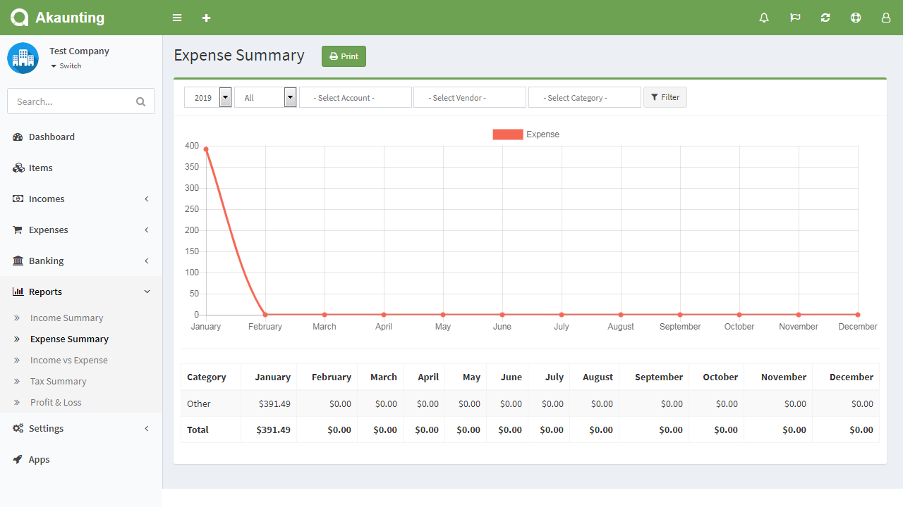

Expense Summary
===============

Expense Summary page is located under **Reports > Expense Summary** menu. This report give you as a business owner a good idea of where your business expense stands, month by month and categorised.

The report is displayed under the default currency. Invoices, revenues, bills, and payments created under a different currency will be converted based on the currency rate at the time they were created.

**All**: Gives you the Accrual Flow summary which means it will combine the Paid and Payables summaries.

**Paid**: Gives you the Cash Flow summary that shows the funds moving out of your accounts based on the actual date of payment.

**Payables**: Gives you the Upcoming Flow summary that shows the funds that you have been billed but not paid to your vendors, yet.

You may select the fiscal year and filter the paid, payables and all expenses.