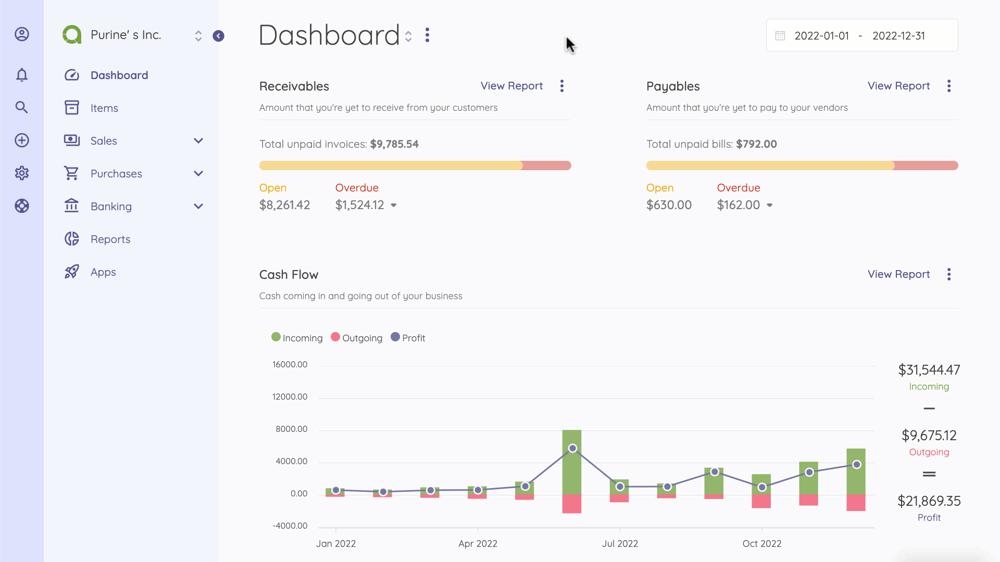
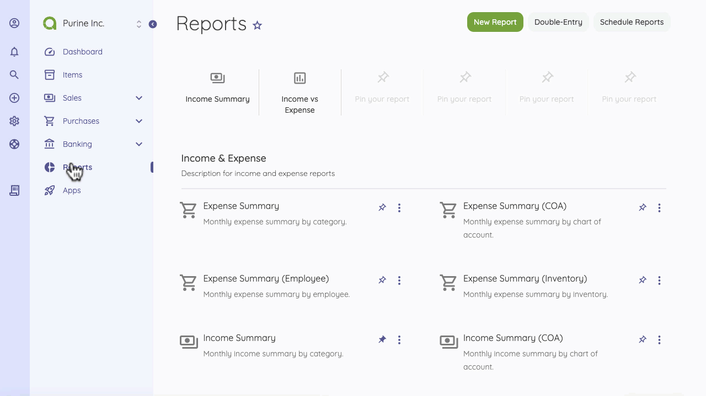
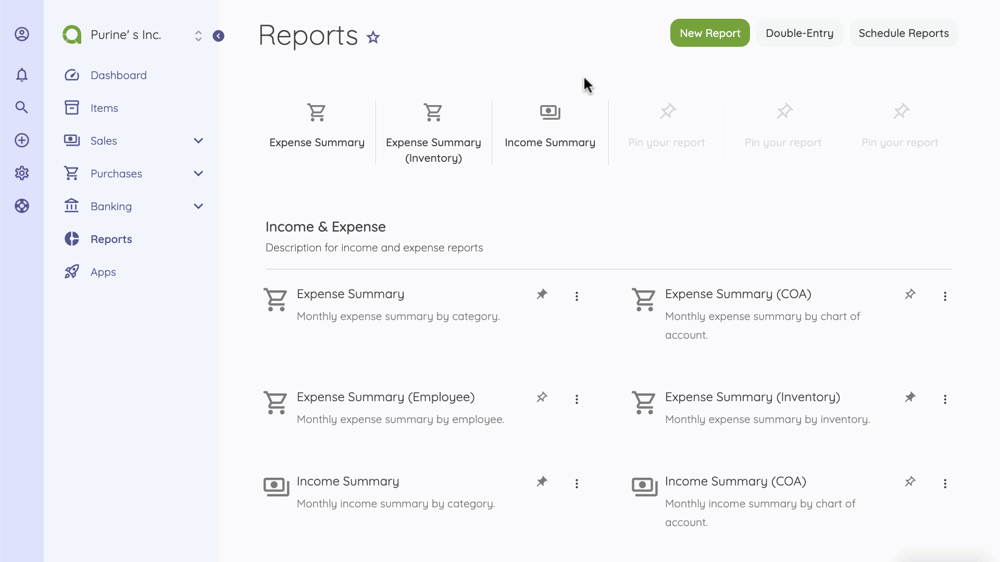
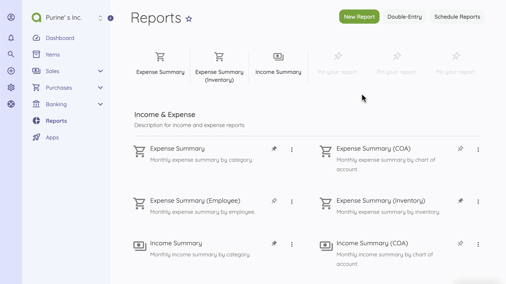

Reports
=========

Reports are available from the sidebar and gives a detailed view of your business’ financial health. 
On this page, you can view all report summaries and be able to edit and delete them. Also, graphics on reports make it easier to understand and analyze your business's financial situation.

You can pin the most used report(s) to the top of the page for quick access.

If you have transactions in foreign currency, don’t worry. Reports are automatically adjusted according to the selected currency rate. But don’t forget to update currency rates from the Settings page. 

Additionally, if you use different currencies, the Live Currency feature (Available on Premium Plan) helps you update exchange rates automatically. If you wish, you can change the currency on the Company Settings page. All reports are displayed in the fiscal year you set up while creating your account and can be changed in  Company Settings.

On the Reports home page, you can see reports  listed by categories, its description, and the vertical ellipsis (three dots) that allows you to edit/duplicate/delete the report. You can also use the search filters to get your preferred data. 

The financial reports make it easy to understand your business performance. You can Print or Export any report. However,  If you need to share reports with your organization or shareholder, [Schedule Reports](https://akaunting.com/apps/schedule-reports?utm_source=suggestion&utm_medium=app&utm_campaign=schedule_reports) would be helpful for you. 

You can also add a report to favorites, which makes it quickly accessible from the sidepanel. 

When creating a new report, the following details are displayed:

- **Name**: The name of the report.
- **Type**: There are 5 default types and it can be extended by apps.
- **Description**: Description to be used in the report list.

The following fields depend on the selected report type:

- **Group By**: You can group reports by category, customer, etc. Each report type has its own groups.
- **Period**: You can set the report on a monthly, quarterly, and yearly basis.
- **Basis**: Here you can learn more about cash and accrual accounting.
- **Chart**: Chart type to be used.

The following action helps you to create a new report

- Go to the Report
- Click on New Report Button 
- Fill out the form 
- Save and create the new report

To automatically schedule reports on a weekly, monthly and custom frequency, use the [Schedule Reports](https://akaunting.com/apps/schedule-reports?utm_source=suggestion&utm_medium=app&utm_campaign=schedule_reports) feature.

**What is the Expense Summary Report?**

The Expense summary report gives you a detailed overview of your company’s transactions in a given period of time; classified under purchases that are payments and bills.
Thes transactions are categorized to help you analyze your expense group. 

**What is the Income Summary Report?**

The Income summary report gives you a detailed overview of your company’s transactions in a given period of time; classified under sales and captured primarily via invoices.

**What is the Income vs. Expense Report?**

Income vs. Expense report is the summary of your sales and purchases. It is calculated by the difference between all transactions under sales and purchases. This report helps you to understand your company’s cash flow in a given period of time. 

**What is the Profit & Loss Report?**

The profit and loss report shows a summary of sales and purchases quarterly. It also helps you understand the financial position of your company during the specified period of time.  

**What is the Tax Summary Report?**

Tax Summary Report gives you a summary of all taxes that you have paid on your expenses or bills and received on invoices or revenues during a specified period. 

In order to analyze the financial status of your business better; General Ledger, Balance Sheet, Chart of Account, and Trial Balance reports are recommended. [Premium Plan](http://akaunting.com/plans) allows you to access these valuable reports. 

Additionally, you may need more reports depending on your business activities. You can check out the [App Store](https://akaunting.com/apps/categories/report). Some of these reports are below. 
- [Aged receivables/payables](https://akaunting.com/apps/aged-receivables-payables)
- [Vendor Statement](https://akaunting.com/apps/vendor-statement)
- [Customer Statement](https://akaunting.com/apps/customer-statement)
- [Time to Get Paid](https://akaunting.com/apps/time-to-get-paid)
