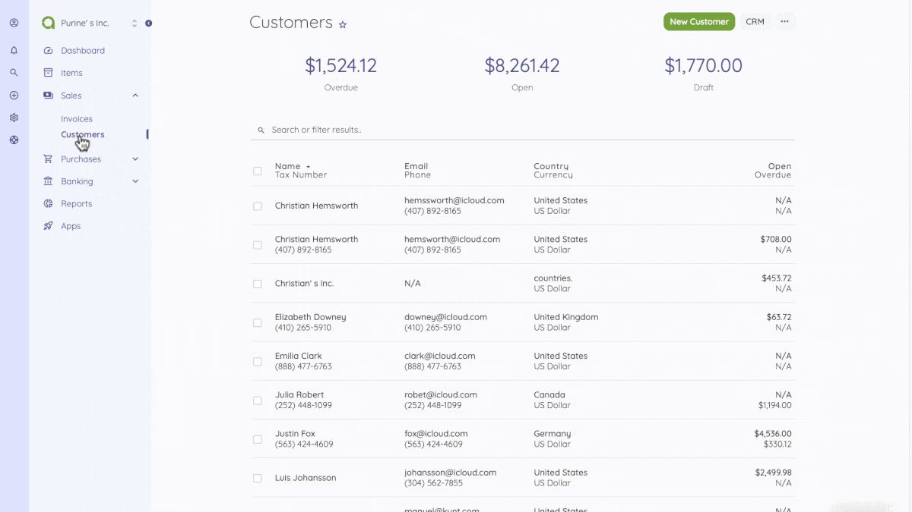
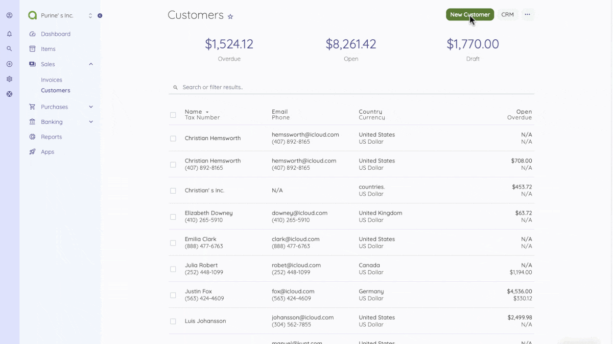

Customers
=========

Customers are the source of a business's income, making them an essential part of your business operations.
You can view the list of all customers under the Sales section. You can add, edit, enable, disable, delete, export, or duplicate a customer. 

At the top of the Customers page, you'll find the New Customer and CRM buttons. The New Customer option allows you to create new customers, while the [CRM option](https://akaunting.com/apps/crm?utm_source=suggestion&utm_medium=app&utm_campaign=crm) lets you create deals. You can add customers by selecting the New Customer button or clicking on the More option to import a list of customers using the XLS or XLSX sheet format.

The following fields are displayed when creating a New Customer:

- **Name**: Customer's full name.
- **Email**: Customer's email address
- **Invite to Client Portal**: When checked, customers access the Client Portal to see/pay the invoices assigned to them.
- **Phone**: Customer's phone number.
- **Website**: Customer's website.
- **Reference**: Any possible reference.
- **Tax Number**: Customer'sVendor's tax number.
- **Currency**: Default currency to be used for the customer.
- **Address finder**: Here, you get a droplist of all customer addresses previously added
- **Address**: Customer's address.

Also, when creating a new customer, there's a [Custom Fields button](https://akaunting.com/apps/custom-fields?utm_source=suggestion&utm_medium=app&utm_campaign=custom_fields) at the top page, which helps you add custom fields to customer data.

After creating a new customer, you can see a list of your customers on the Customers home page.
By checking a customer on the Customers page, you get the options to enable, disable, delete or export a customer.

A mouse hover on a listed customer reveals the options to show, edit, duplicate or delete.
To import a list of customers, you should download the sample template.