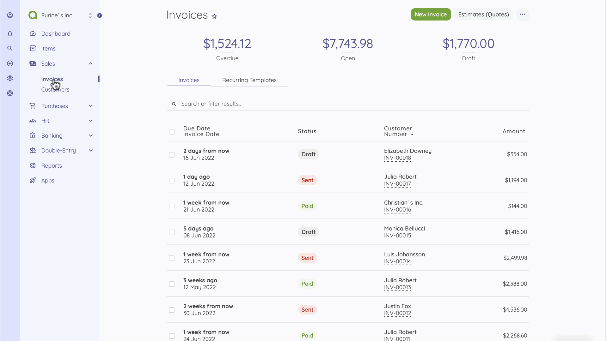
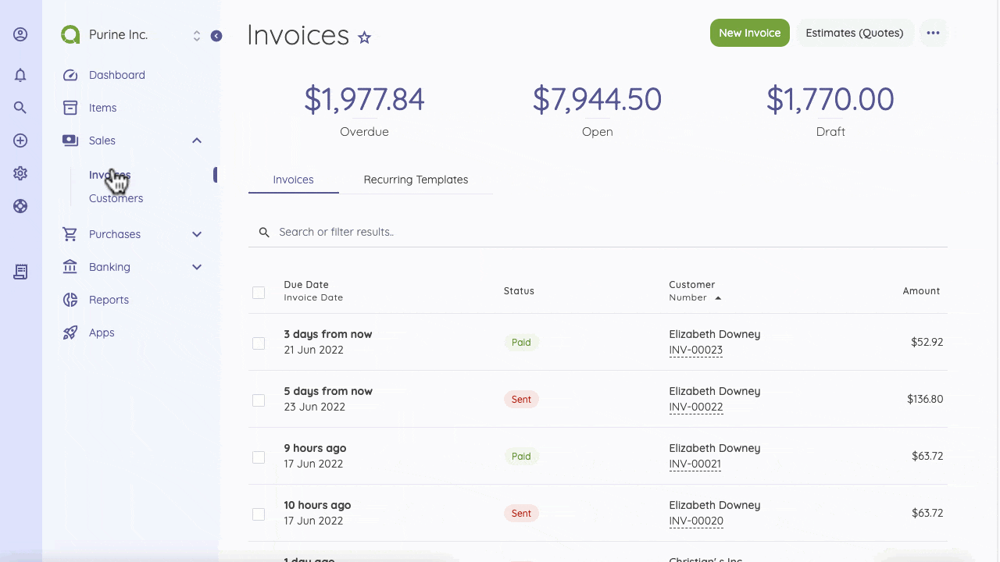
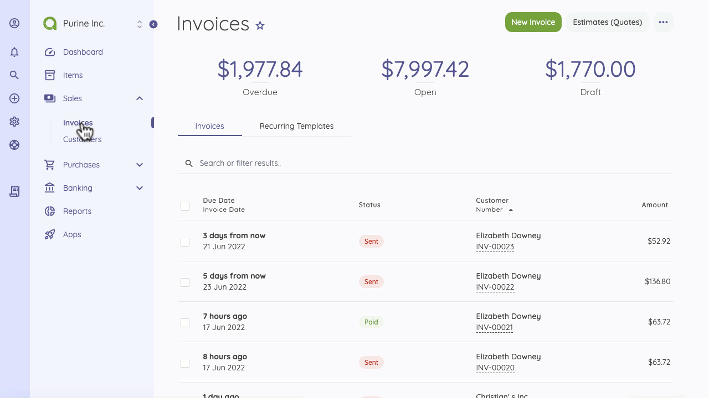
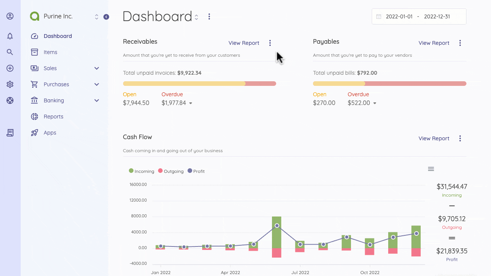
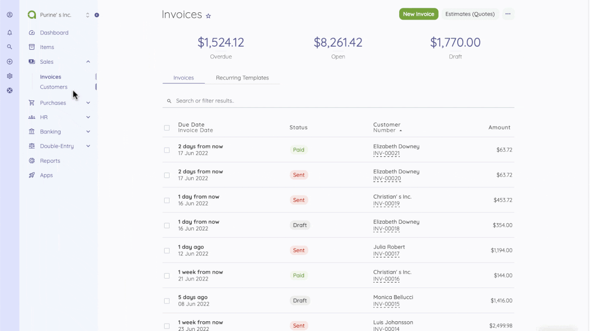

Invoices
=========

An invoice is a commercial document that contains a list of items (products or services) with their cost for payment at a later time. You are running a business to provide solutions and record sales; hence, creating an invoice is one of the most used actions in Akaunting. Invoices are located under Sales. 

At the top of the Invoices page, you will see the overview of all your invoices. Here, all invoices are listed and can be sorted by date, Status, or amount.

To create an invoice, click on the New Invoice button at the top of the Invoices page and fill out the fields. Although some fields are not required, they make it easier to track your reports. 

When creating an invoice, you need to enter the recipient of the invoice through the "Add a customer" option and fill in other mandatory fields like the invoice date, due date, and number.
 You add items by selecting from your list of items and also add discounts/taxes for each item on an invoice. 
Below the items section, you can also enter an overall discount for items listed on an Invoice.

After creating an invoice, you can send it at that time or save it and send it later from the invoices page. 

While sending an invoice, enter a custom message in the pop-up email box. 
After sending an Invoice, you view an invoice page that displays details such as the date, the recipient, and the payment status.

The Status of an invoice changes automatically when the recipient confirms payment or views the invoice. You can also update the status of an invoice manually by clicking the "add payment" button. 
If, for some reason, an invoice recipient confirms payment, however, you are yet to receive payment, you can click on "delete payment" on the selected invoice page to undo the transaction.

You can customize your invoices through Invoice Settings, and Email Settings(Insert anchor link) allows you to customize your email templates.

The following fields are displayed on the New Invoice page:

- **Customer**: The receiver of the invoice.
- **Invoice Date**: Date when the invoice is issued.
- **Due Date**: Date when the invoice is scheduled for payment.
- **Number**: The number assigned to the invoice.
- **Order Number**: A number assigned to that invoice.
- **Items**: The list of items that you can n to that invoice. You can add multiple items from your list of items.
- **Quantity**: Enter the number of products or services on offer.
- **Price**: The sales price of the item. This will automatically be updated from the listed price of the item. You can also change the price if you want.
- **Tax**: Choose from a list of applicable Tax Rates as set by you. You can select multiple taxes. See the Settings > Tax Rates documentation for more details.
- **Total**: This is calculated automatically according to the item quantity, discount, and tax. It is not an editable field. To change the total amount, you should change the item price, quantity, or discount.
- **Notes**: You can add a custom note to the invoice.
- **Category**: Category of the invoice to be used in reports.
- **Attachment**: You can attach a file related to the invoice.

On the Invoice page, you can see the status of the invoices. 
The Status of an invoice can be:

**Sent** - when you send the invoice; 

**Paid** - when the receiver confirms payment, or you add payment manually;

**Viewed** - when the recipient views the mailed invoice; 

**Draft** - When you create and save an invoice without sending; and 

**Partial** - when the total amount is not recorded.

You can complete the following actions to create a new invoice
- Go to the Invoice Page or directly click the Invoice button on the quick add section
- Click on New Invoice Button
- Fill out the form (Here, you can add a new customer and item instantly)
- Save or Send the Invoice
