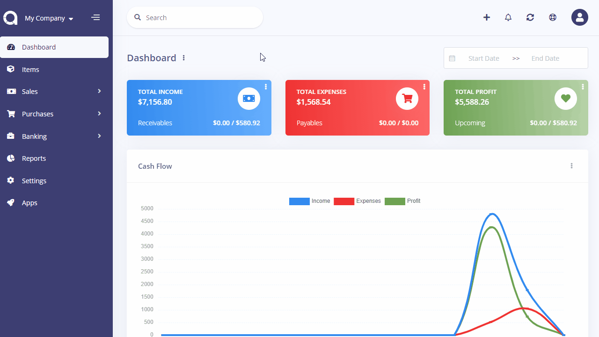

Revenues
========

Revenue is a paid income transaction. It can be an independent record (i.e. deposit) or attached to an invoice. There are no items within the revenues. Tax is not applicable.

Revenues page is located under **Sales > Revenues** menu and the following fields are displayed:

- **Date**: Paid date.
- **Amount**: Amount of the revenue.
- **Customer**: Who paid the revenue.
- **Category**: Category of the revenue.
- **Account**: Account paid to.
- **Actions**: You can use this button to edit, duplicate, and delete the revenue.

## New Revenue

The following fields are displayed as blank to be filled, some are required and some not. Those marked with red star are required.

- **Date**: Paid date.
- **Amount**: Amount of the revenue.
- **Account**: Account paid to.
- **Description**: Custom description for the revenue.
- **Category**: Category of the revenue to be used in reports.
- **Recurring**: Automatically create revenues for ongoing jobs. Times=0 means infinite. Don't forget to set the *Cron Command* available at *Settings > [Scheduling](https://akaunting.com/docs/user-manual/settings/scheduling)*.
- **Customer**: Who paid the revenue.
- **Payment Method**: Method used to pay the revenue.
- **Reference**: Any possible reference.
- **Attachment**: You can attach file related to the revenue.
- **Invoice**: You can attach the payment to an invoice.

