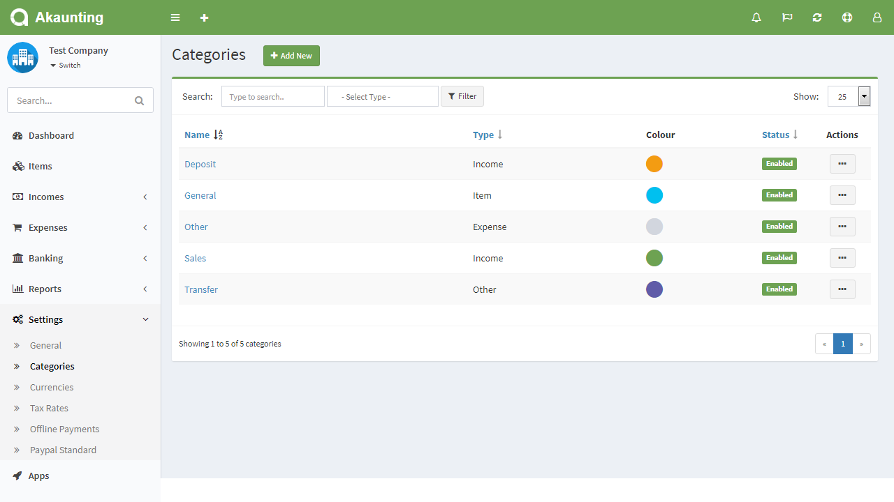
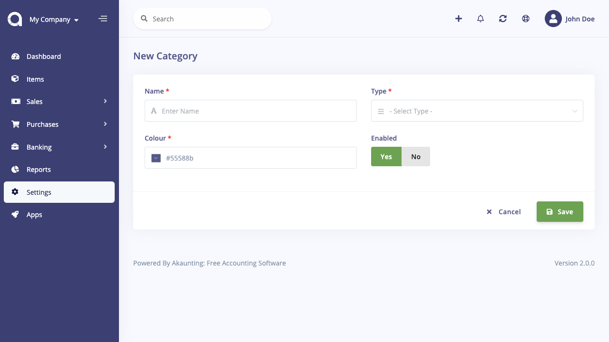

Categories
==========

Categories help you separate items, incomes, and expenses from each other.

Categories page is located under **Settings > Categories** menu. On this page you can see all categories, search for any, create a new one, edit the current ones and delete them.

The following fields are displayed:

- **Name**: Category's name.
- **Type**: Categories are shown in items, incomes, and expenses page based on type.
- **Colour**: Category's colour, used in dashboard charts.
- **Status**: Status of the category.
- **Actions**: You can use this button to edit, and delete the category.

## New Category

The following fields are displayed as blank to be filled, some are required and some not. Those marked with red star are required.

- **Name**: Category's name.
- **Type**: Type of category. It will be shown in items, incomes, and expenses page based on type.
- **Colour**: This colour will be used in dashboard charts.
- **Enabled**: Status of the category.

