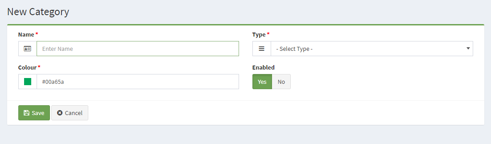

Categories
========

To access the Categories page in the administration, hover over the Settings button and click on Categories in the drop-down. You will be a directed to a page that displays the category names (as seen below).

The categories above were included with the default products provided by the install. You may delete them to make room for the store's product categories. The red "**Delete**" button on right side of each category will help you to remove the category completely. The blue "**Edit**" button will help you to edit a specific category, or you can click over the name of the category to redirect to you edit page.

Clicking "**Edit**" button will direct the administrator to a form to change the category information. Clicking "**Add New**" will allow the shop owner to insert more categories to the site.

Create a category
-----------------

There are four (4) pieces of information associated with each new Category: the Name, Type, Colour and Enabled.

- **Category Name**: To reiterate, the Category Name must be unique.
- **Type**: Is the type of category that means for with operation you want to use this category.
- **Colour**: Allows you to add a special colour for each category.

- **Enabled**: Selecting "Yes" makes the category publicly available in the store front. Selecting "No" will hide the category from operation pages, but will still be available for editing purposes in the administration.
