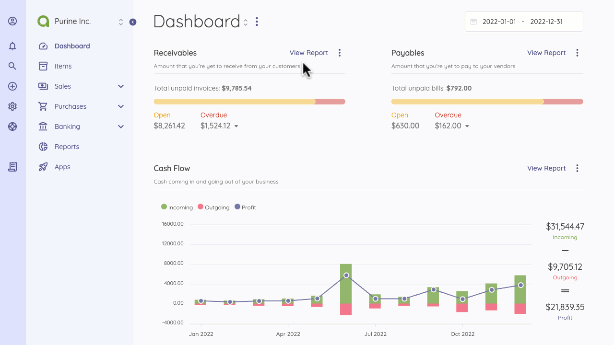

Company Settings
================

Company settings page is located under **Settings** menu. On this page you can set up the settings for each company.

- **Name**: Company's name.
- **Email**: Company's email.
- **Tax Number**: The tax number to be used in invoices.
- **Phone**: Company's phone number.
- **Address**: The company address to be used in invoices.
- **Logo**: The company logo to be used in client portal, invoices etc.

