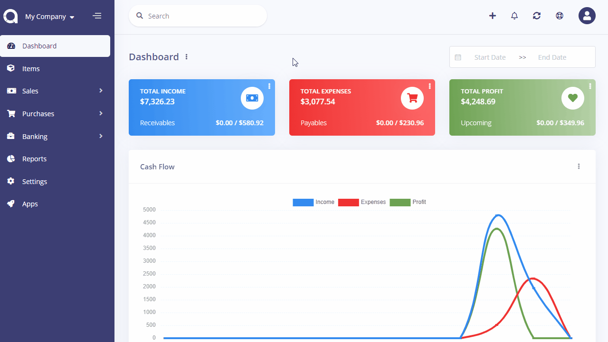

Currencies
==========

Currencies page is located under **Settings > Currencies** page. On this page you can see all currencies, search for any, create a new one, edit the current ones and delete them.

The following fields are displayed:

- **Name**: Currency's name.
- **Code**: Unique ISO code of currency.
- **Rate**: The rate against the default currency. Default currency rate is always 1.
- **Status**: Status of the currency.
- **Actions**: You can use this button to edit, and delete the currency.

## New Currency

The following fields are displayed as blank to be filled, some are required and some not. Those marked with red star are required.

- **Name**
- **Code:** The ISO code for the currency. Currency codes can be looked up at this [currency converter](http://www.oanda.com/currency/?srccont=rightnav).
- **Rate:** The rate against the default currency. Default currency rate is always 1.
- **Precision:** This defines number of fractions to be used.
- **Symbol:** The symbol of currency.
- **Symbol Position:** The position symbol.
- **Decimal Mark:** The mark to be used for decimal part.
- **Thousands Separator:** The mark to be used for thausands part.
- **Enabled:** Status of the currency.
- **Default Currency:** Set as the default currency of company. All reports are shown under the default currency.

