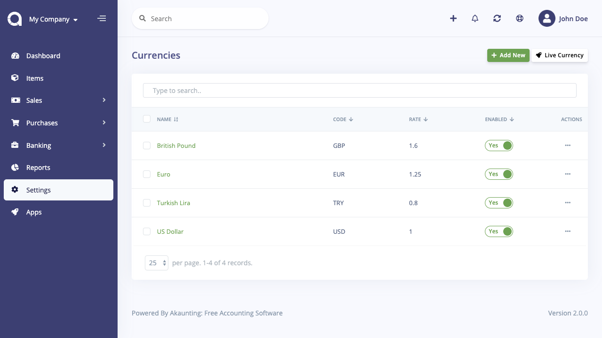
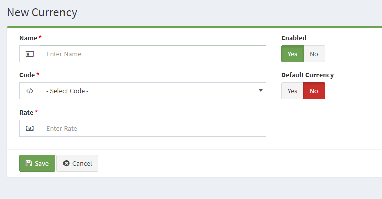

Currencies
==========

The currencies sections lets you select which currencies are available for use in software. The default currency will display all the prices in that currency. The currency preference can be changed by the customer in the header section of any page in the front office.

In the store below, we have enabled the **British Pound**, **Euro**, **Turkish Lira** and **US Dollar**.

The following information is needed about a currency to add it to your software:

- **Currency Name**
- **Code:** The ISO code for the currency. Currency codes can be looked up at this [currency converter](http://www.oanda.com/currency/?srccont=rightnav).
- **Rate:** The Default currency will be set to a value of 1. Every value of currency will be relative to this value. Since the US Dollar is 1.0 (the default), the Euro is tabulated to .81 for the value based on its worth.
- **Default Currency:** The default currency prices will be displayed in.
- **Status:** Enables or disables the currency in the software.

