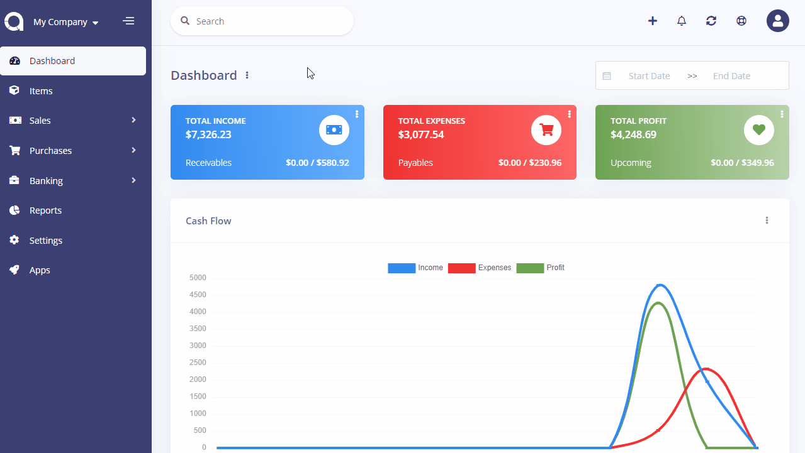

Default Settings
================

Default settings page is located under **Settings** menu. On this page, you can set up the settings for each company.

|     Setting      | Description                                                            |
| :--------------: | :--------------------------------------------------------------------- |
|     Account      | Default account to be used when marking invoices/bills as paid.        |
|     Currency     | Default currency to be used in charts etc.                             |
|       Tax        | Default tax to be used when creating an item, customer, etc.           |
|  Payment Method  | Default payment method to be used when marking invoices/bills as paid. |
|     Language     | Default language to be used in the User Interface.                     |
| Records Per Page | Number of records to be shown in list page.                            |
|   Use Gravatar   | Select whether to use gravatar as profile picture at the right top.    |

