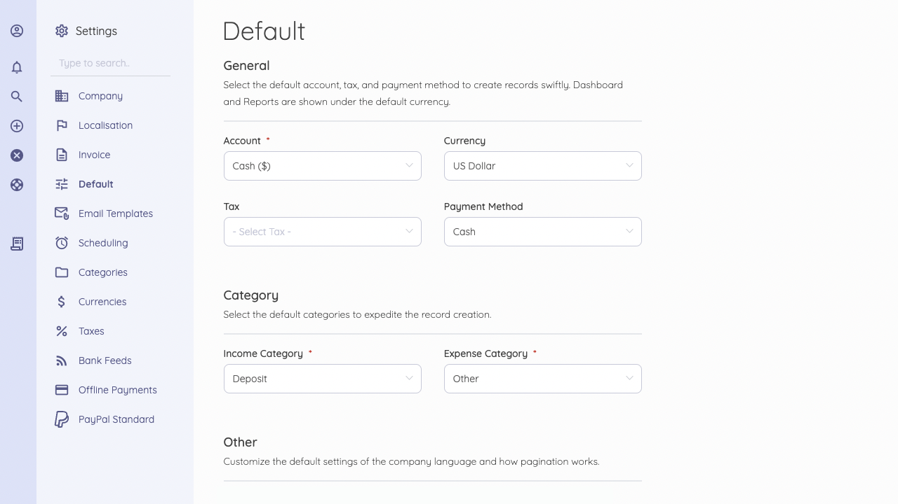

Default
=========

Set the default for Account, Currency, Payment method, Income category, and more. If you have multiple companies, please note that each company has its defaults Settings page, and you would have to switch between companies for this. (You can switch between your companies by clicking the company name on the top left side). 
While creating an account, you set up your companies based currency. If you change your company's currency, your report's default currency will also change. Hence, you should adjust currency rates.

Below are the defaults you can adjust:

**General**

- **Account**: Default account to be used when marking invoices/bills as paid.
- **Currency**: Default currency to be used in charts etc.
- **Tax**: Default tax to be used when creating an item, customer, etc.
- **Payment Method**: Default payment method to be used when marking invoices/bills as paid.

**Categories**

- **Income Category**: Select the default category to expedite income creation.
- **Expense Category**: Select the default category to expedite expense creation.

**Other**

- **Language**: Default language to be used on the User Interface.
- **Records Per Page**: Number of records to be shown on the list page.

