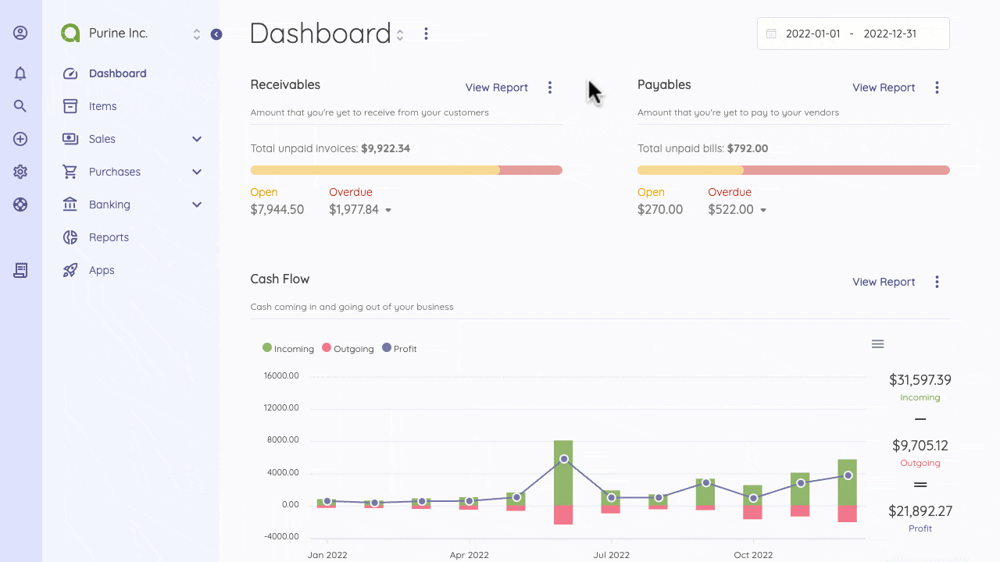

Email Templates
=========

By default, there are four categories with email templates:
- Bills
- Invoices
- Payments
- Others

Each category has an email template(s) that specifies the receiver, and the copies can be customized according to your preference. Receivers are classified into the Admin, the Customer, and the Vendor.

You can edit the Subject line and Body of the email templates by selecting the record type on the left and choosing the email for whom the template is created. 

You can use the suggested tags summarized at the bottom of the page in the "Available tags" section to enhance your invoice personalization. 

Note that to send emails to your customers, you must add their email addresses on the customer's page.

