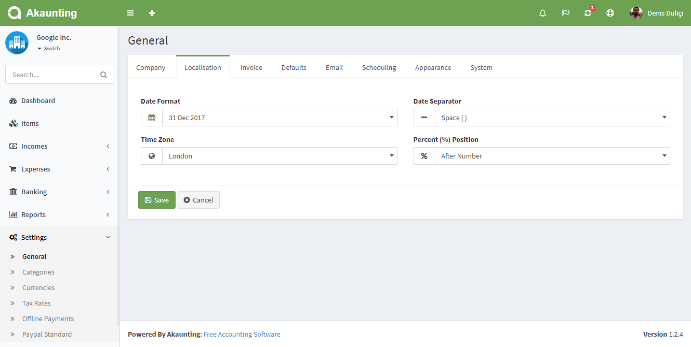
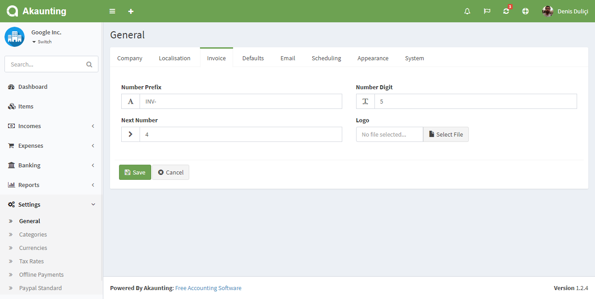
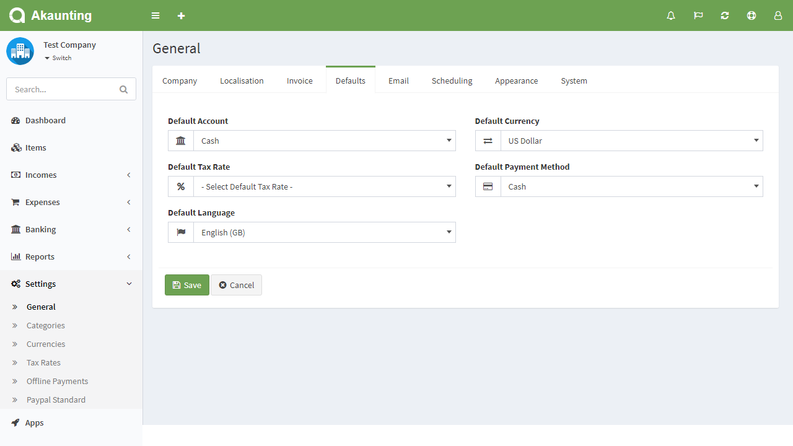
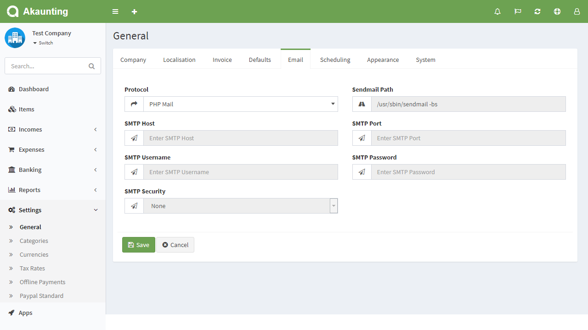
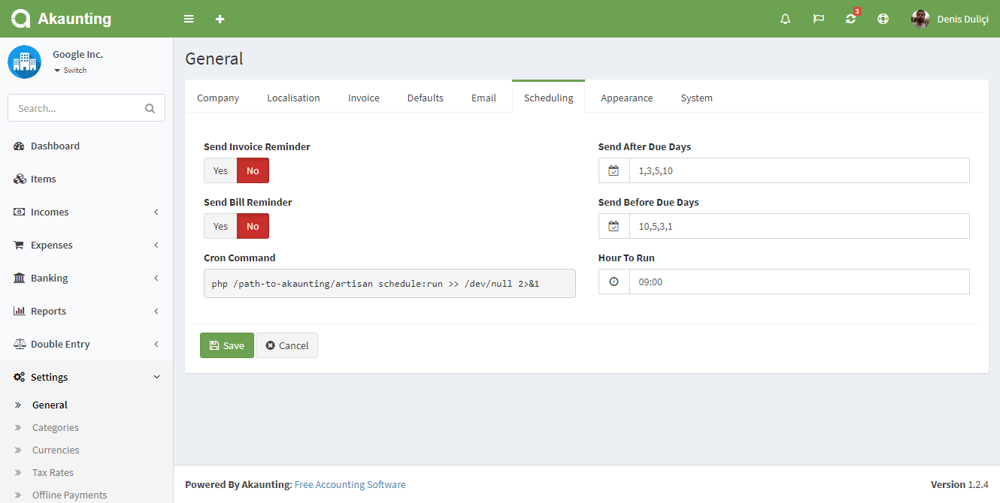

General Settings
================

General settings page is located under **Settings > General** menu. On this page you can set up the settings for each company.

## Company

- **Name**: Company's name.
- **Email**: Company's email.
- **Tax Number**: The tax number to be used in invoices.
- **Phone**: Company's phone number.
- **Address**: The company address to be used in invoices.
- **Logo**: The company logo to be used in client portal, invoices etc.

## Localisation

- **Date Format**: The date format to be used everywhere.
- **Data Seperator**: The seperator of date format
- **Time Zone**: The time zone of company.
- **Percent Position**: Select the position of the percentage sign.

## Invoice

- **Number Prefix**: The word to be placed before the invoice number.
- **Number Digit**: The number of digits of invoice number.
- **Next Number**: The next invoice number.
- **Logo**: The company logo to be used in invoices.

## Defaults

- **Default Account**: The default account to be used when marking invoices/bills as paid.

## Email

- **Protocol**: Choose between sending mail to the host's email, or through an SMTP.

## Scheduling

- **Send Invoice Reminder**: Send invoice reminder email to your customers.
- **Send After Due Days**: Enter the days after the due date to send the invoice reminder.
- **Send Bill Reminder**: Send bill reminder email to yourself.
- **Send After Due Days**: Enter the days after the due date to send the bill reminder.
- **Cron Command**: Copy the command and enter into your Cron Job system. Replace the *path-to-akaunting* part whith the full path where you've installed Akaunting. Contact your hosting provider to get further help about Cron.
- **Hour To Run**: Enter the hour you want the command to run.

