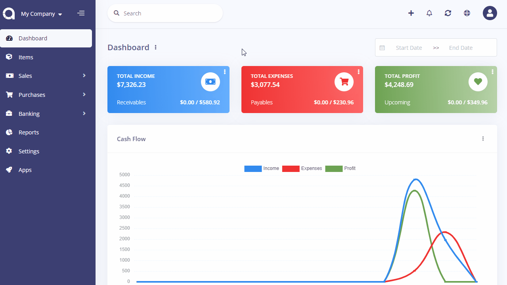

Invoice Settings
================

Invoice settings page is located under **Settings** menu. On this page you can set up the settings for each company.

- **Number Prefix**: The word to be placed before the invoice number.
- **Number Digit**: The number of digits of invoice number.
- **Next Number**: The next invoice number.
- **Payment Terms**: Default payment terms. You can override this each time you create an invoice.
- **Title**: Default title for invoices.
- **Subheading**: Default subheading that will be displayed below the title of each invoice.
- **Footer**: Default footer that will be displayed at the bottom of each invoice. You can override it per invoice.
- **Item Name**: The text to be used for items.
- **Price Name**: The text to be used for price.
- **Quantity Name**: The text to be used for quantity.
- **Logo**: The company logo to be used in invoices.

