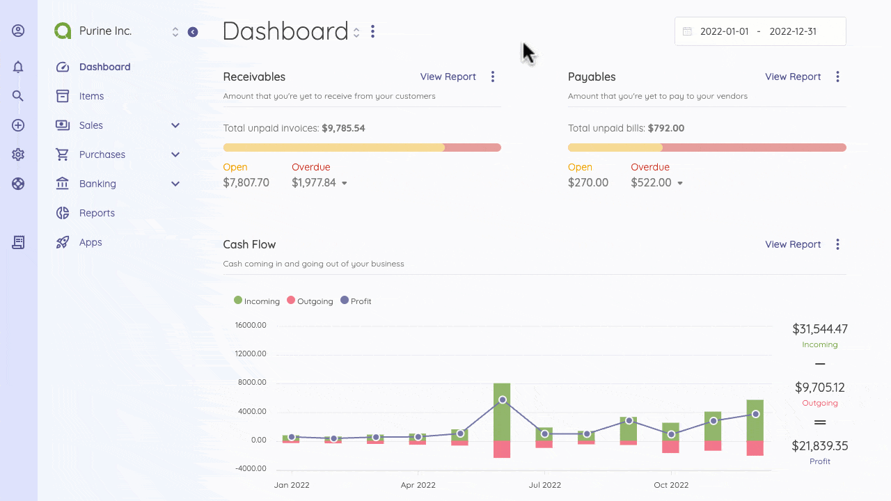

Invoice
=========

You can create a new invoice template or select from a list of invoice templates. Invoice Setting allows you to set the defaults for formatting your invoice numbers and payment terms.

You can also customize one of the three default templates. 

The fields below are not required, but they may be crucial if you need to personalize your invoices.  

General Terms & IDs for Invoices
- **Number Prefix**: The word to be placed before the invoice number.
- **Number Digit**: The number of digits of the invoice number.
- **Next Number**: The upcoming invoice's number.
- **Payment Terms**: Default payment terms. You can override this each time you create an invoice.

Defaults for Invoices
- **Title**: Invoice title.
- **Subheading**: Subheading that will be displayed below the title of each invoice.
- **Footer**: The specified footer display for the bottom of each invoice. You can override this per invoice.

Column Personalization
- **Item Name**: The title content used for items can be personalized.
- **Price Name**: The title content used for the price can be personalized.
- **Quantity Name**: The title content used for quantity can be personalized. 
- **Logo**: The company logo to be used in invoices.

