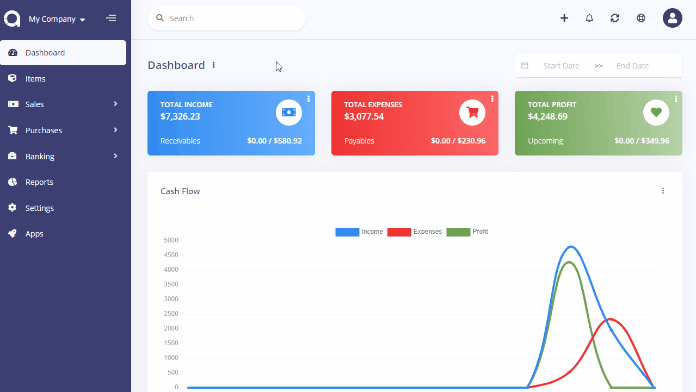

Localisation Settings
=====================

Localisation settings page is located under **Settings** menu. On this page you can set up the settings for each company.

- **Financial Year Start**: The day and month of financial year start.
- **Time Zone**: The time zone of company.
- **Date Format**: The date format to be used everywhere.
- **Data Seperator**: The seperator of date format
- **Percent Position**: Select the position of the percentage sign.

