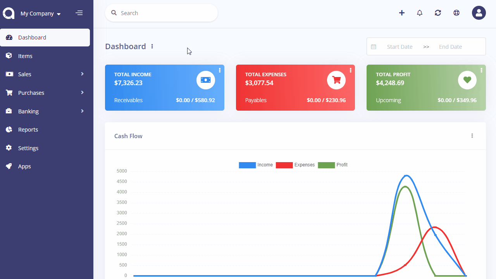

Offline Payments
================

Offline payments are generally used by admins to categorize the method through which they receive payments. They can also be used to show offline payment details to customers. For example, you can create a Bank Transfer payment method and enter your bank account details so that your customer may transfer the invoice amount.

Offline Payments page is located under **Settings > Offline Payments** page. On this page, you can see all offline payments, create a new one, edit the current ones and delete them.

The following fields are displayed:

|  Field  | Description                                                    |
| :-----: | :------------------------------------------------------------- |
|  Name   | Payment method name.                                           |
|  Code   | Payment method code.                                           |
|  Order  | The order when showing.                                        |
| Actions | The edit button will auto-fill the input box of the left form. |

## Add New

The following fields are displayed as blank to be filled, some are required and some not. Those marked with red star are required.
|      Field       | Description                                                                                                       |
| :--------------: | :---------------------------------------------------------------------------------------------------------------- |
|       Name       | The name to be shown.                                                                                             |
|       Code       | Payment method code.                                                                                              |
| Show to Customer | If enabled, your customer will see this payment method in the Client Protal so they could use it to pay invoices. |
|      Order       | Which order you want to show it.                                                                                  |
|   Description    | You may add a custom description. For example, your bank account details.                                         |

