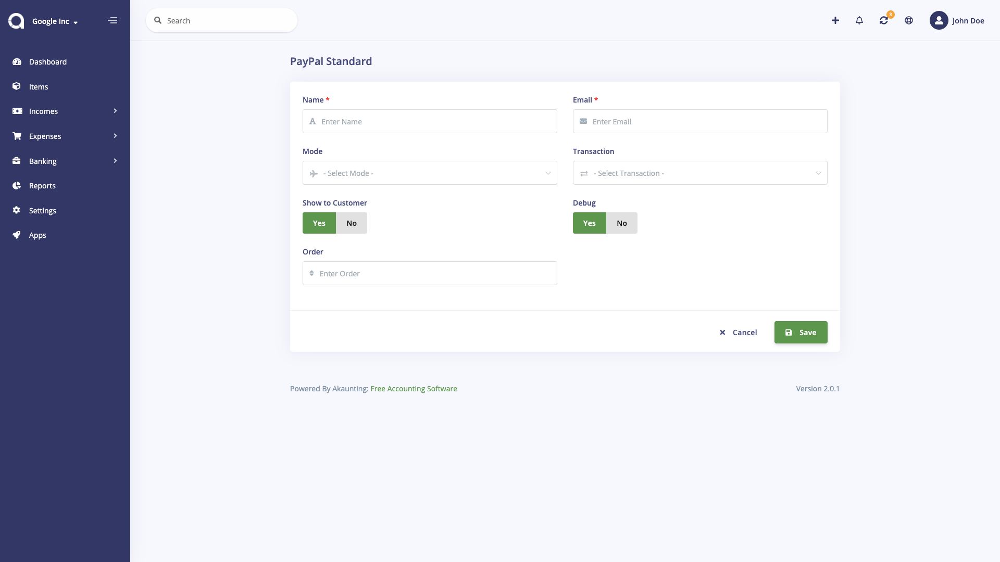

PayPal Standard
================

PayPal Standard page is located under **Settings > PayPal Standard** menu. On this page you can enter your PayPal details.

The following fields are displayed:

- **Name**: The name to be shown.
- **Email**: Your PayPal account's email, where customer will make the payment.
- **Mode**: You can use the Sandbox mode for test purposes.
- **Transaction**: Select between Sale or Authorization.
- **Show to Customer**: If enabled, your customer will see this payment method in the Client Protal so they could use it to pay invoices.
- **Debug**: Log the callback data.
- **Order**: Which order you want to show it.

