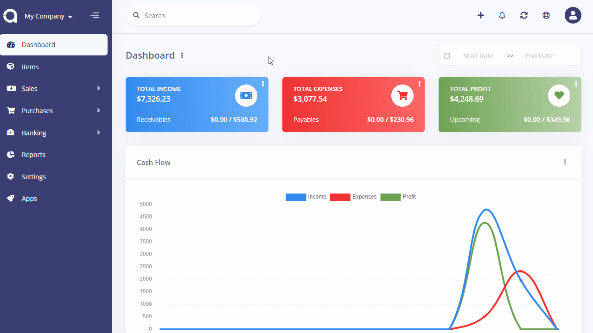

Scheduling Settings
===================

Scheduling settings page is located under **Settings** menu. On this page, you can set up the settings for each company.

|                           Setting                           | Description                                                                                                                                                                                                                      |
| :---------------------------------------------------------: | :------------------------------------------------------------------------------------------------------------------------------------------------------------------------------------------------------------------------------- |
|                    Send Invoice Reminder                    | Send invoice reminder email to your customers.                                                                                                                                                                                   |
|                     Send After Due Days                     | Enter the days after the due date to send the invoice reminder.                                                                                                                                                                  |
| Send Bill Reminder**: Send bill reminder email to yourself. |
|                     Send After Due Days                     | Enter the days after the due date to send the bill reminder.                                                                                                                                                                     |
|                        Cron Command                         | Copy the command to your Cron Job system. Set it to run *every minute*. Replace the *path-to-akaunting* part whith the full path where you've installed Akaunting. Contact your hosting provider to get further help about Cron. |
|                         Hour To Run                         | Enter the hour you want the command to run.                                                                                                                                                                                      |

