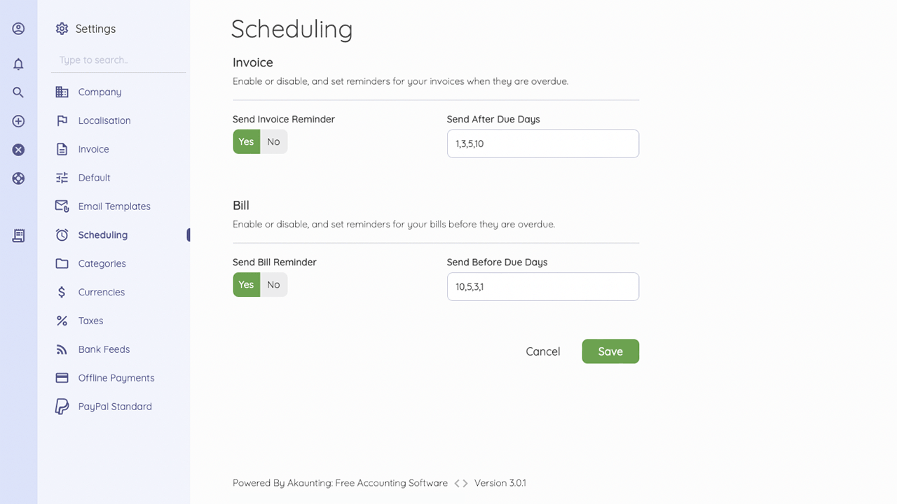

Scheduling
=========

You can enable or disable reminders for your overdue/upcoming invoices or bills here.

These reminders work with your email templates and automatically send emails based on your schedule.
Once you set a reminder, you do not need to update it when creating a new record.

The following fields are found on the scheduling page:
 
- **Send Invoice Reminder**: You can enable/disable the send invoice reminder email to your customers.
- **Send After Due Days**: Type in the days after the due date to send the invoice reminder.

- **Send Bill Reminder**: You can enable/disable bill reminder email for yourself. 
- **Send After Due Days**: Type in the due date to send the bill reminder.

