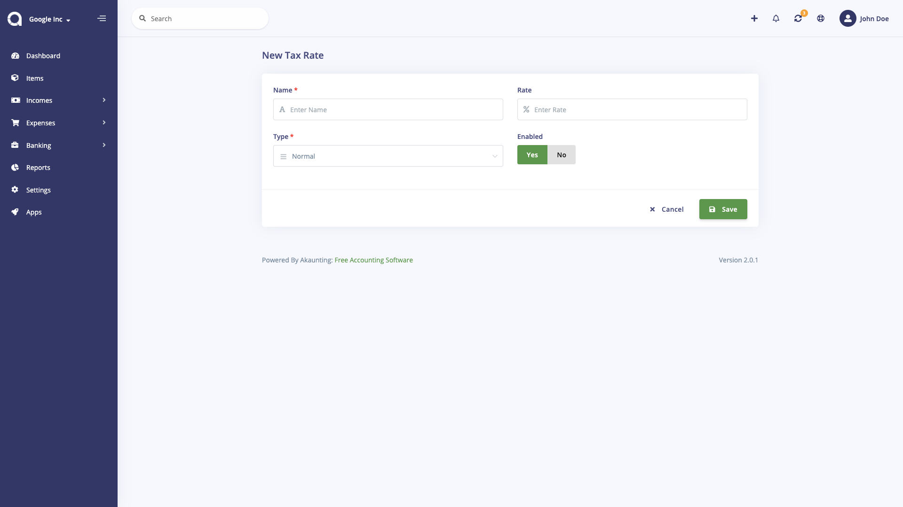

Tax Rates
=========

Tax is be used to apply fee to invoices, revenues, bills, and payments.

Tax Rates page is located under **Settings > Tax Rates** menu. On this page you can see all tax rates, search for any, create a new one, edit the current ones and delete them.

The following fields are displayed:

- **Name**: Tax's name.
- **Rate**: Tax's rate.
- **Status**: Status of the tax.
- **Actions**: You can use this button to edit, and delete the tax.

## New Tax Rate

The following fields are displayed as blank to be filled, some are required and some not. Those marked with red star are required.

- **Name**: Tax's name.
- **Rate**: Tax's rate as a percentage.
- **Enabled**: Status of the tax.

