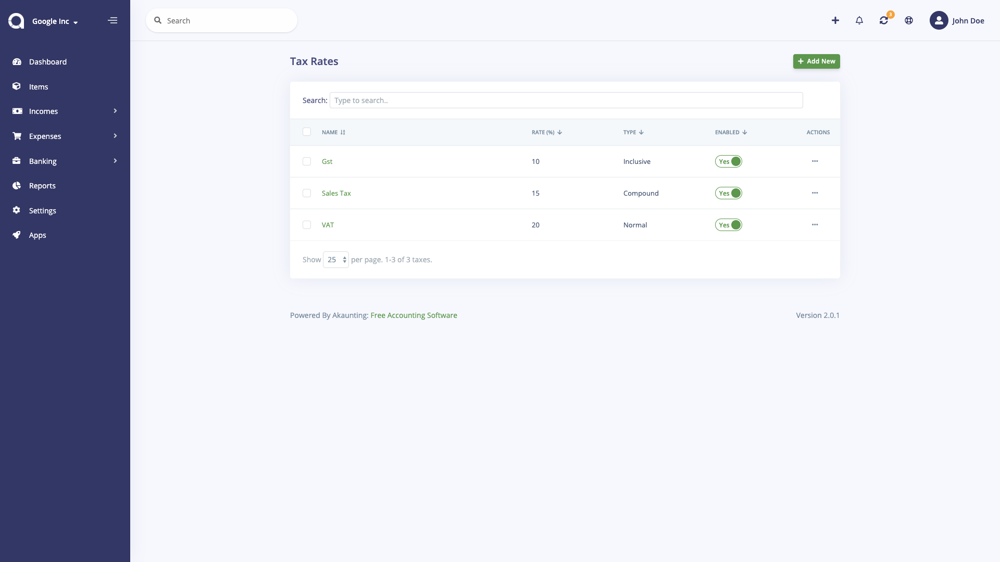
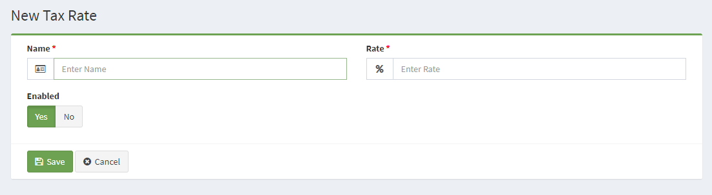

Tax Rates
=====

To access the Tax Rates page in the administration, hover over the Setting button and click on Tax Rates in the drop-down. You will be a directed to a page that displays the taxes names (as seen below).

The tax rate will be used to calculate the taxes from an invoice, bill, revenue and payment. The following information is needed to save a tax rate to the administration:

**Create a Tax Rate**
---------------------
There are four (3) pieces of information associated with each new Tax Rate: the Name, Rate and Enabled.

- **Tax Name**: A name for the tax that will be displayed in the store front when taxes are added to order total.
- **Tax Rate**: A number value for the tax.
-  **Enabled**: Selecting "Yes" makes the tax rate publicly available in the software. Selecting "No" will hide the tax rate from operation pages, but will still be available for editing purposes in the administration.

