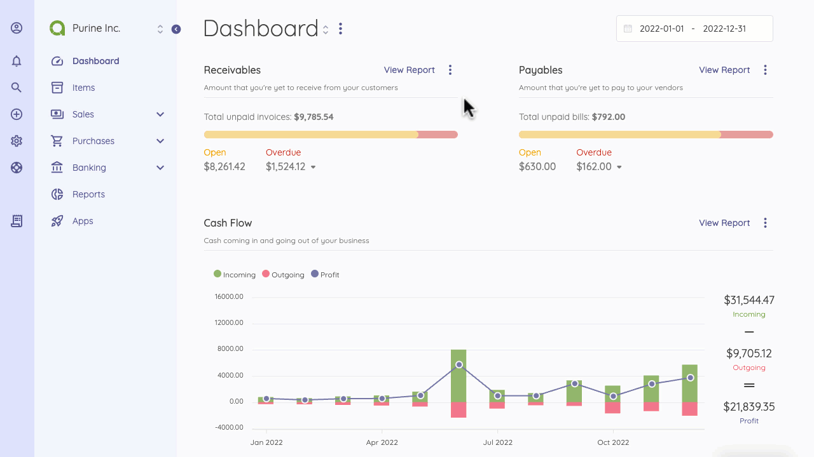
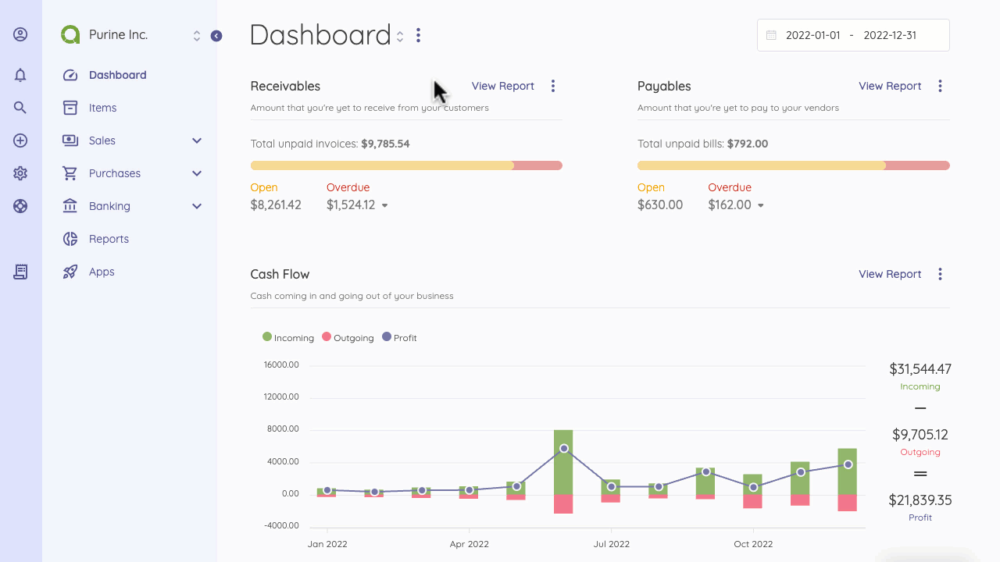

Overview
=========

The UI Framework reveals the main navigation and the content areas. There are three main areas on Akaunting 3.0:

- Sidebar
- Navigation Menu
- Content Area

Sidebar
=========

The Sidebar is a section for navigating through your Akaunting workspace. The section helps you personalize your profile and company and can be collapsed or expanded with a click of the collapse menu icon. 

Expanding the menu pans out options that allow you to navigate the workspace and handle your daily to-dos with a couple of clicks.

On the side, you have icons for easy access to:

Profile
=========

Here, you can personalize your profile - update the company's name, users, subscriptions, plans, teams, and roles; send tickets and access rewards. You can log out through the profile menu. 

Notifications
=========

The bell-shaped icon displays in-app notifications. Akaunting notifies you of recurring records you may need to take action on. Announcements on Akaunting or alerts for the applications you are subscribed to will also appear here.

Search
=========

You can search globally for all records created on your Akaunting account. This includes items, invoices, transactions, and more. Click on the magnifier and search for any record in Akaunting from customers to expenses. 

Quick Add
=========

The plus (+) icon allows you to easily create invoices, clients, and transactions without navigating to their main pages.

Settings
=========

The Sidebar section also contains the settings menu where you can personalize Akaunting and all your subscribed apps. Settings allow you to customize how your Akaunting behaves - make changes to your company, choose a default currency, define your financial year, and configure installed apps. Take a step further for more personalization in settings.

Help
=========

Get access to the [support page](https://akaunting.com/support) where you can submit tickets, access the Akaunting community, or speak to dedicated support personnel.

Favorites
=========

This part of the Sidebar is an easter bunny. When you favorite a page, it appears on the Sidebar for quick access from any page. You can add a page to favorites by clicking on the star icon at the top, beside the title. All favorite pages appear on the Sidebar.

