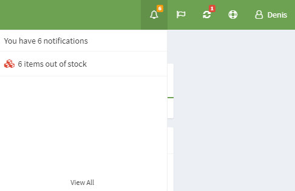
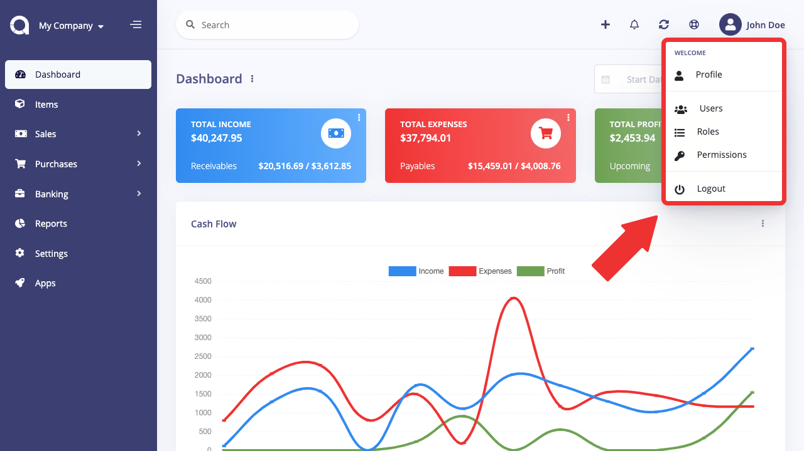

Toolbar
=======

The toolbar is used to gives quick access to the most used or common parts of Akaunting.

### Quick Add

The plus button at the left side of toolbar speeds up the progress of adding new **Income**, **Expense** and **Banking** records.

### Notifications

The bell button at the right side of toolbar will show any available notification, per user/customer. It will notify if there is any item out of stock or there is an invoice/bill overdue.

### Languages

The flag button at the right side of toolbar shows the languages Akaunting is translated. Is your language's translation incomplete for Akaunting? Or you don't have one?
[Join](https://crowdin.com/project/akaunting) among our translators and start to translate Akaunting today easily.

### Updates

The arrows button at the right side of toolbar will show any available update for Akaunting and any app installed.

### Help

The life ring button at the right side of toolbar will redirect you to this documentation.

### User

The user button at the right side of toolbar shows your profile and links to the Users, Roles and Permissions pages.
